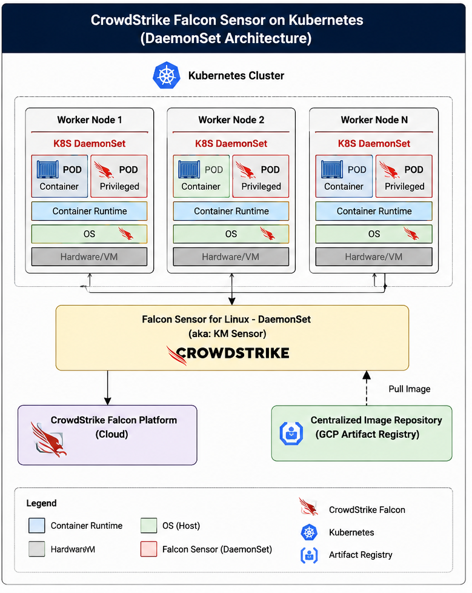

# CrowdStrike-Falcon-Sensor-Deployment-on-Kubernetes-using-DaemonSet


Enterprise-grade CrowdStrike Falcon Sensor deployment for Kubernetes using DaemonSet across EKS, AKS, and GKE with centralized Artifact Registry integration.


# CrowdStrike Falcon Sensor on Kubernetes

Enterprise-grade CrowdStrike Falcon Sensor deployment using Kubernetes DaemonSet across:

- Amazon EKS
- Azure AKS
- Google GKE

---

# Features

- Multi-cloud Kubernetes support
- Centralized GCP Artifact Registry integration
- DaemonSet deployment model
- Runtime threat detection
- Enterprise security standardization
- Automated deployment workflow

---

# Architecture



---

# Repository Structure

```bash
docs/
scripts/
helm/
manifests/
diagrams/
```

---

# Documentation

| Document | Description |
|---|---|
| architecture.md | Architecture overview |
| deployment-guide.md | Full deployment steps |
| stakeholder-guide.md | Stakeholder deployment instructions |
| troubleshooting.md | Common issue fixes |

---

# Supported Platforms

- AWS EKS
- Azure AKS
- Google GKE

---

# Deployment Method

- Kubernetes DaemonSet
- Helm-based installation
- Centralized Artifact Registry

---

# Quick Start

```bash
kubectl create namespace falcon-system
```

```bash
helm install falcon-sensor crowdstrike/falcon-sensor
```

---

# Security Notes

- Falcon Sensor runs as a privileged container
- Requires node-level access
- Uses Production CID during deployment

---

# Author

Santhosh Kumar  
Cloud Security Engineer | Multi-Cloud Security | Container Runtime Security

